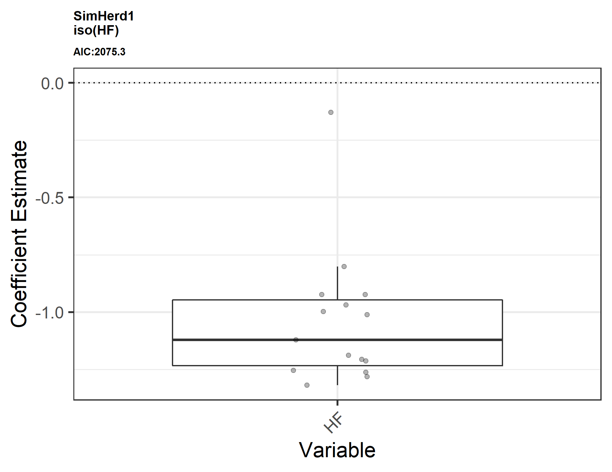
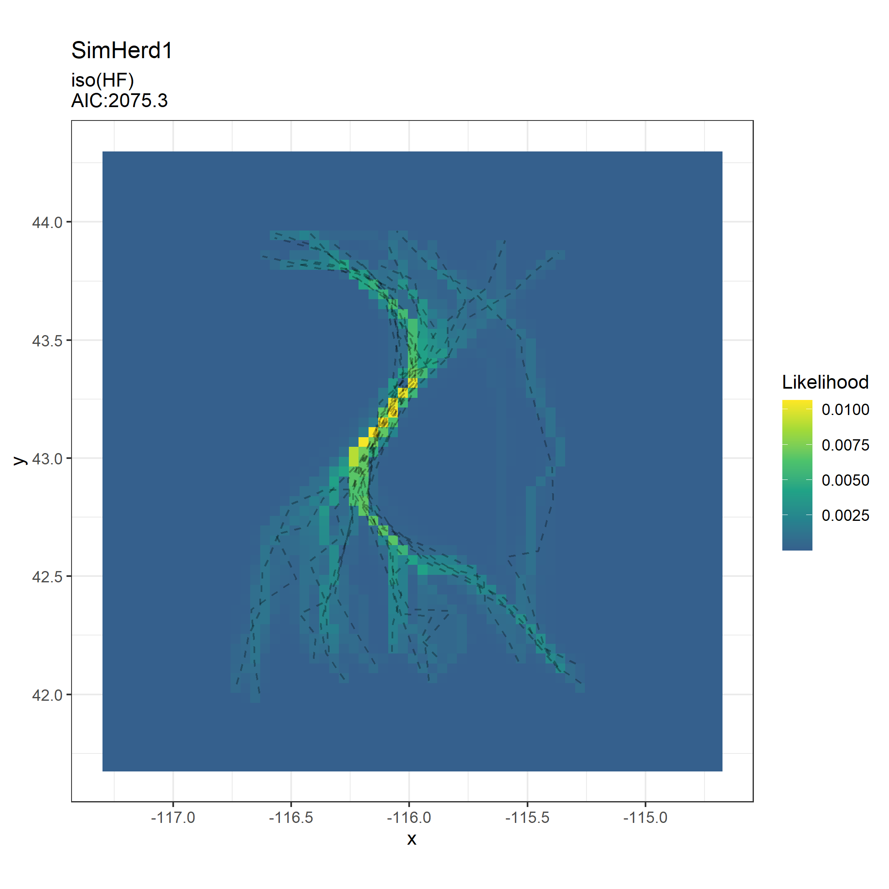
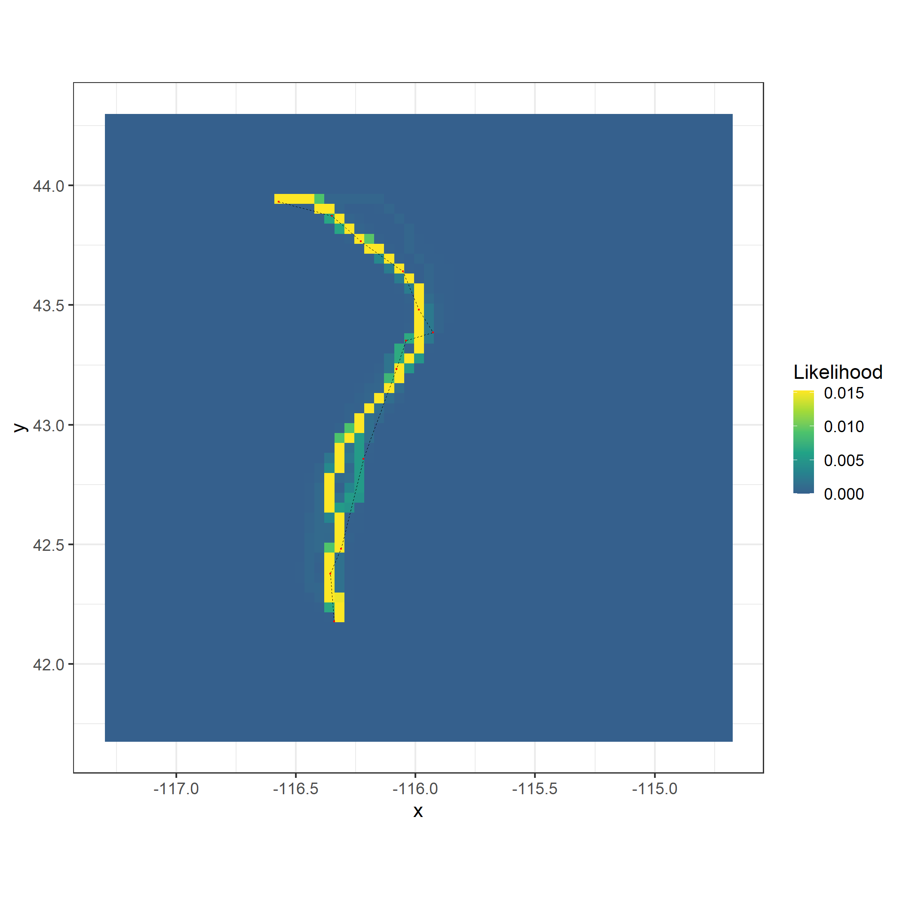
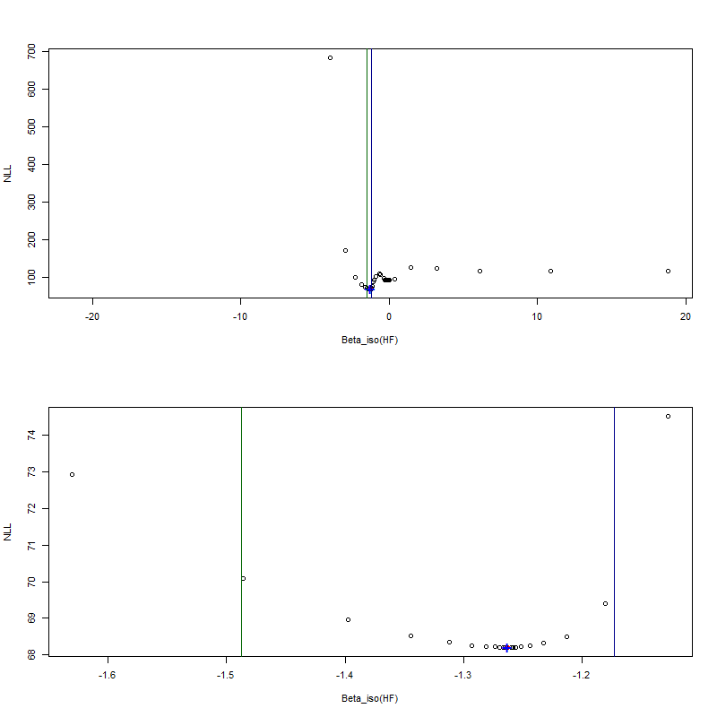

```{r setup, include = FALSE}
knitr::opts_chunk$set(
  collapse = TRUE,
  comment = "#>"
)
```

This vignette accompanies the article "A statistical framework for predicting migration corridors" by Nuñez, T., Hurley, M., Graves, T. Ortega, A. Sawyer, H., Fattebert, J., Merkle, J., and Kauffman, M., accepted for publication in  *Methods in Ecology and Evolution*, and the fitcorridor code to go with it. 

The fitcorridor code fits cost-distance models to animal movement tracks. 

The fitcorridor model fitting code will be updated in the future (including conversion to R package format). Check the github page for the latest version at github.com/tristannunez/fitcorridor.  

## Getting Started

Review the manuscript, which outlines the calculations and algorithms involved in fitting cost-distance models to movement tracks; Figure 1 and Sections 2.2 through 2.8 of the Methods section are particularly relevant. 

## Prerequisites
The code requires the following R packages be installed: gdistance, parallel, rgdal, ggplot2, ggspatial, and rgeos. Make sure they are installed before proceeding. 

## Let's fit a cost-distance model!
We'll begin by fitting a cost distance model to a set of simulated movement tracks. The model we will fit is $conductance = e^{\beta \cdot Human Footprint}$. For each movement track, the code will find the value of $\beta$ that maximizes the likelihood of the data given the model. It will also find the optimal value of $\lambda$, the rate parameter of the exponential distribution used to model the probability of deviations from the least cost path (see Methods Section 2.4 in the manuscript). 1/λ is the mean residual cost distance of the fitted distribution, allowing us to directly assess how far on average an animal deviates from the modeled least cost path in cost distance units.

### Setting up
First, make sure your working directory is the fitcorridor folder:
```{r, message=F, results=F}
getwd()
```
Source the R file containing the functions.
```{r, message=F, }
source("./fitcorridor_functions.R")
```
Read in the animal movement tracks. In this case, we will be using a set of 15 tracks simulated from a human footprint surface. 
```{r message=F, fig.width = 6, fig.asp=1}
tracks<-readOGR("./data/tracks/HF_sim_tracks.shp", stringsAsFactors = F)
# Set the coordinate reference system
mycrs <- "+proj=longlat +ellps=WGS84 +datum=WGS84 +no_defs +towgs84=0,0,0"
crs(tracks) <- mycrs
# turn the tracks into SpatialLinesDataFrame just for plotting
tracks$id <- tracks$trackid # TrackSPDFtoTrackSPLFLines requires an $id column
tracks.as.lines <- TrackSPDFtoTrackSPLFLines(tracks)
plot(tracks.as.lines)
plot(tracks, add=T, col="red", pch=".", cex=1.2)
```

Read in the environmental covariates. Here, we will read in the human footprint surface previously used to simulate the movement tracks. This data is from Leu et al. 2008 (https://doi.org/10.1890/07-0480.1, http://sagemap.wr.usgs.gov/), cropped to the Boise, ID area.  
```{r, message=F, fig.width = 6, fig.asp=1}
# Higher values represent more human influence
covars <- brick("./data/covariates/HF.tif")
# specify the Coordinate Reference System
crs(covars) <- mycrs 
# assign names to layers
names(covars) <- c("HF") # if more than one layer, use this format: c("HF", "DEM")
# plot to check 
plot(covars)
plot(tracks.as.lines, add=T, cex=.75)
plot(tracks, add=T, pch=".", col="red", cex=1.2)
```

The simulated tracks, which move between randomly selected start and end points in the upper and lower quarter of the human footprint raster, avoid areas of high human footprint. This is because they were simulated using a $\beta$ value of -1.

### Running the model fitting code
Now that we have read in the inputs, we can fit the cost distance model $conductance = e^{\beta \cdot Human Footprint}$ to the movement tracks. We do this using the FitSingleModel function:
```{r message=F}
FitSingleModel(
  tracks = tracks,
  covars = covars,
  model.to.fit = "iso(HF)",
  neighbors = 8,
  covar.aggregate = 1,
  covar.standardize = c(1),
  param.factor = c(1),
  startval.string = c(-5, 0),
  dataset = "SimHerd1",
  out.folder.path = "./fittedmods/",
  n.inside.cores = 4,
  Lt.tiff = T
)
```
This takes around ten minutes on a PC laptop (Intel(R) i7 CPU @ 2.90GHz with 4 cores). Disregard the "In .local(x, ...) : all fact(s) were 1, nothing to aggregate" warning. Let's explore each of the arguments for the FitSingleModel function:

#### tracks
A SpatialPointsDataFrame. The dataframe needs to have a 'trackid' column with a unique id for each movement track. Must have the same coordinate reference system as `covars`. The movement track needs to be a directed movement, so that it is consistent with the assumptions of cost distance modeling, particularly that the animal is acting to minimize its movement costs (or maximize its movement benefits) as it moves between the start and end of the track. For example, any loops (a track doubling back on itself) would violate this assumption and inflate the amount of variance in the model fit.

#### covars
A Raster* object. Must have the same crs as `tracks`. Must have the same names (use names(covars) to check) as the variable names in `model.to.fit`; for example, if `model.to.fit` is "iso(HF)+iso(DEM)," then HF and DEM should be the names of layers found in `covars` (the order of the variables in the model do not need to be in the same order as the order of the variables in `covars`). `covars` must have an extent not just larger than `tracks`, but sufficiently large that the spatial likelihood surfaces generated in modeling approach zero at their boundaries. This is established with trial and error, but using an extent 1.3 to 1.5 times larger than the extent of `tracks` is a good starting point.

#### model.to.fit
A character string. Specifies the variables to be included in the model as well as the type of cost-distance calculation to be used. iso() results in an isotropic cost distance calculation, and aniso() results in an anisotropic (stepwise difference) cost distance calculation. For example, if we use "HF" and "DEM" as variable names for Human Footprint and Elevation, respectively, then the model $e^{\beta_1 \cdot Human Footprint + \beta_2 \cdot Elevation_{diff}}$ would be specified as "iso(HF)+aniso(DEM)". Note there are no spaces and "+" is used to separate terms, and that the variable names must be the same as the names of the layers in the `covars` Raster* object. See the manuscript for descriptions and uses of isotropic and anisotropic calculations. 

#### neighbors
The number of directions in which cells are connected (4 (rook's case), 8 (queen's case), 16 (knight and one-cell queen moves), or other), see ?raster::adjacent. 

#### covar.aggregate
A positive integer. Controls how `covar` is spatially aggregated to speed computation by reducing resolution. It is the aggregation factor expressed as number of cells in each direction (horizontally and vertically). This is passed to the "fact" argument of raster::aggregate(), see documentation of that function for more details. A value of 1 will keep the original resolution of `covar`, but will throw this warning: "In .local(x, ...) : all fact(s) were 1, nothing to aggregate". 

#### covar.standardize
A numeric vector with the same length as the number of terms in model.to.fit (the terms are separated by "+"). Specifies for each term in model.to.fit whether that variable should be standardized by the raster::scale() function; a value of 1 will standardize, whereas a value of 0 will not standardize the variable. As currently implemented, the code only scales, but does not center the variable (see raster::scale() for details. Generally, isotropic variables are scaled and anisotropic variables are not scaled, in order to aid in model fitting convergence. 

#### param.factor
A numeric vector with the same length as the number of terms in model.to.fit. This factor multiplies the $\beta$ coefficient. A value of 1 has no effect; for isotropic variables, use 1. For unstandardized anisotropic variables, try 10 or 100 for elevation (in meters), and 100 or 1000 for variables with Julian day units, such as snow-off date. 

#### startval.string
A numeric vector that specifies the starting value for each parameter (including log(lambda)) for the optimization routine. `startval.string` is one element longer than the number of terms in `model.to.fit`. The first element of the vector is the start value for log(lambda), and typically a value between -5 and -10 works well for this. The remaining elements correspond to the model terms (in order), and 0 (no effect) generally works well for these. 

#### dataset 
A character string that names the output folder. It can be the name of the animal herd, population, or individual that the tracks in `tracks` come from, or any other useful descriptor.  

#### out.folder.path
A character string that names the folder where outputs from running the model should be written. Note that the folder name should be enclosed by ./ and / , as in "./fittedmods/"

#### n.inside.cores
A positive integer specifying how many cores are used in the parallel computing portion of the model fitting process. Should be less than the number of available cores and less than the number of movement tracks in `tracks`. See the help for parallel:makeCluster(). 

#### Lt.tiff 
Logical. If TRUE, the spatial likelihood surfaces for each track ($L_{t}$) and for all tracks in `tracks` ($L_{h}$) will be written out as GeoTiffs, as well as a plot of $L_{h}$.  

## Exploring the model outputs
Check the "./fittedmods/SimHerd1/iso(HF)" folder to explore the results! First, we can look in the output folder for this dataset and model to see the contents:
```{r message=F}
dir("./fittedmods/SimHerd1/iso(HF)")
```

#### AIC_etc.csv

The first CSV file `AIC_etc.csv` contains information about the model fit including AIC, the negative log likelihood, and estimates of log(lambda) at the herd level. 

```{r, message=FALSE, results='asis'}
knitr::kable(read.csv("./fittedmods/SimHerd1/iso(HF)/AIC_etc.csv"))
```

* nll_h is the negative log likelihood of the herd (ie., -log(l_h) from the manuscript)

* loglambda.mean and loglambda.sd are the mean and standard deviation of the estimates of loglambda for each track

* alltrackconverge is a Boolean: 1 if the optimization converged in the optim() function for all tracks; 0 if not

* AIC is the AIC of the model, and can be used to compare this model to the fits of other models. 

* AICc is the AICc of the model 

* k is the number of parameters in the model  (number of model terms + 1 for lambda)

* ntracks is the number of individual movement tracks

* model is the model that was run

* dataset is the name assigned to the collection of tracks (corresponds to herd in the manuscript)

* resolution is the cell size in the units of the coordinate reference system. Assumes square pixels

* neighbors is the number of neighbors used in the analysis

#### beta_hs_w_95CIs.csv
```{r, message=FALSE, results='asis'}
knitr::kable(read.csv("./fittedmods/SimHerd1/iso(HF)/beta_hs_w_95CIs.csv"))
```
`beta_hs_w_95CIs.csv` contains information about the fitted coefficients -- this is where to look to assess the effect of environmental covariates on your movement tracks. Each column of beta_hs_w_95CIs.csv corresponds to a parameter (in this case only log(lambda) and 'HF', as our model includes only these two parameters), except for the column 'descr', which describes the quantity reported in each of the rows.  

* upper95CI_SEMmethod is the upper 95% confidence interval calculated using the standard error of the mean of the track estimates

* beta_h is the herd-level estimate of the coefficient for a specific parameter (or the average loglambda value for loglambda). In our example, the estimate of beta_h of -1.0399086 is close to that used to simulate the movement tracks. 

* lower95CI_SEMmethod is the lower 95% confidence interval calculated using the standard error of the mean of the track estimates

* stdev.of.beta_ts is the standard deviation of the beta_ts, the track-level coefficient estimates

* lower95CI_mean_of_hessian_method and upper95CI_mean_of_hessian_method are the mean of the respective confidence intervals calculate using the standard error estimated from the Hessian matrix produced by optim()

* std.err.mean is the standard error of the mean used to calculate the confidence intervalse using the SEM of the track estimates


#### beta_ts.csv: 
```{r, message=FALSE, results='asis'}
knitr::kable(head(read.csv("./fittedmods/SimHerd1/iso(HF)/beta_ts.csv"), 6))
```

`beta_ts.csv` provides information about the model fit and the coefficients for each individual track in the `tracks` (here we just see the first six rows). 

* columns lCI, uCI, and SE are the lower and upper 95% CIs and standard error estimated from the Hessian from optim() for that specific track and parameter. optim() often returns NA when the Hessian cannot be calculated

* column est is the beta_t estimate (or loglambda estimate) for the track in column "trackid" and for the variable in "vars"

* tracknll is -log(l_t), the negative log likelihood of the track likelihood

#### betas_boxplot.png 

`betas_boxplot.png` is a boxplot of the fitted $\beta_{t}$ values for all the tracks in `tracks`. 
```{r, out.width = "400px"}

```

#### L_h.png 

`L_h.png` is a plot of the herd-level spatial likelihood surface $L_{h}$ that combines the track-level likelihoods, as well as the tracks whose endpoints were used to generate the likelihood surface. 
```{r, out.width = "400px"}

```

#### Lh_raster
is the raster of L_h in GeoTiff format.

#### Lt_rasterstack 
is a raster stack of all of the L_t surfaces, in the order of the tracks in the track shapefile, in GeoTiff format. 

#### /indivtrackfits/
This folder contains plots of the L_t surfaces for each track. Visual inspection can indicate how well the model fits each movement track.

For example:
```{r, out.width = "400px"}

```

#### /likprofiles/
This folder contains the likelihood profiles for each track and each parameter. 

For example:
```{r, out.width = "400px"}

```

The top plot contains all values that were evaluated in the profile. The lower plot is zoomed in to likelihood values within 10 likelihood units of the minimum likelihood. The green and blue lines are the 95% CIs, estimated from the likelihood profile data. The blue "+" is the parameter estimate from optim(). The red dot is the estimate in the profile with the lowest negative log likelihood. If in calculating a profile a better set of parameter values (> than 0.1 likelihood units better) is found than was found by optim(), the likelihood profile will be recalculated and replotted.    

Exploring the likelihood profiles can help determine whether the optimization successfully found a minimum in the negative log likelihood values for a particular variables, and to understand the overall shape of the likelihood surface. 

